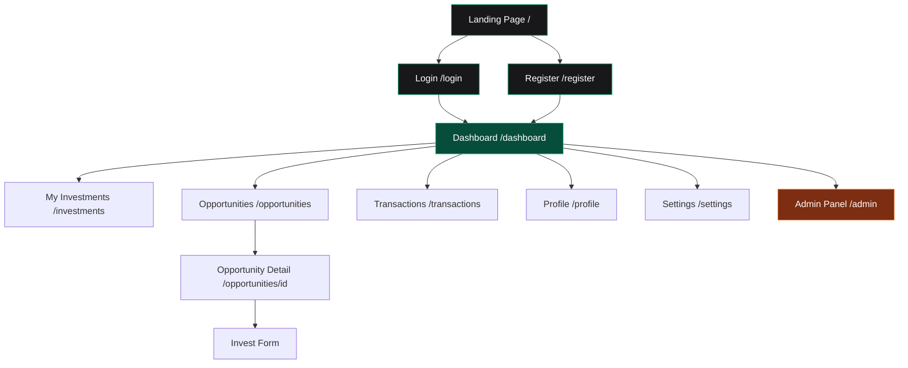

# Banna Capital — Project Status & Phases Roadmap

## Current Status: ✅ Phase 1 Complete | ✅ Phase 2 Complete | ✅ Phase 3 Complete | 🔜 Phase 4 Next

---

## ✅ Phase 1 — Project Setup & Database (COMPLETED)

**Git Commit:** `0a46ad3` — *"Setup Supabase and database schema"*

| Item | Status |
|------|--------|
| Next.js 16 project initialization | ✅ Done |
| Tailwind CSS v4 setup | ✅ Done |
| Supabase project connection | ✅ Done |
| Environment variables (`.env.local`) | ✅ Done |
| Database schema in Supabase | ✅ Done |

### Database Tables Created (in Supabase):
- **`profiles`** — `id`, `name`, `phone`, `role` (investor/admin), `created_at`
- **`investments`** — tracking investment records
- Row Level Security (RLS) policies configured

### Files Created:
- [package.json](file:///c:/Users/DELL/Desktop/banna-capital/package.json) — Dependencies: `@supabase/ssr`, `@supabase/supabase-js`, `lucide-react`, `react-hot-toast`
- [lib/supabase.ts](file:///c:/Users/DELL/Desktop/banna-capital/lib/supabase.ts) — Browser-side Supabase client
- [lib/supabase-server.ts](file:///c:/Users/DELL/Desktop/banna-capital/lib/supabase-server.ts) — Server-side Supabase client (async cookies for Next.js 16)

---

## ✅ Phase 2 — Authentication & Dashboard UI (COMPLETED)

**Git Commit:** `9e78487` — *"Add authentication UI and dashboard"*

| Item | Status |
|------|--------|
| Login page (`/login`) | ✅ Done |
| Register page (`/register`) | ✅ Done |
| Dashboard page (`/dashboard`) | ✅ Done |
| Route protection (proxy/middleware) | ✅ Done |
| Logout functionality | ✅ Done |
| Toast notifications | ✅ Done |
| Form validation (inline errors) | ✅ Done |
| Password show/hide toggle | ✅ Done |

### Files Created:

#### Authentication Pages
- [app/login/page.tsx](file:///c:/Users/DELL/Desktop/banna-capital/app/login/page.tsx) — Login with email/password, inline validation, glassmorphism UI
- [app/register/page.tsx](file:///c:/Users/DELL/Desktop/banna-capital/app/register/page.tsx) — Registration with name, email, phone, password + profile insertion into Supabase

#### Dashboard
- [app/dashboard/page.tsx](file:///c:/Users/DELL/Desktop/banna-capital/app/dashboard/page.tsx) — Server component with sidebar nav, welcome banner, stat cards (Total Invested, Expected Profit, Active Investments, Pending Investments)
- [app/dashboard/LogoutButton.tsx](file:///c:/Users/DELL/Desktop/banna-capital/app/dashboard/LogoutButton.tsx) — Client component for sign-out

#### Route Protection
- [proxy.ts](file:///c:/Users/DELL/Desktop/banna-capital/proxy.ts) — Next.js 16 proxy (replaces middleware). Protects `/dashboard`, `/profile`, `/investments`, `/admin`. Redirects authenticated users away from `/login` and `/register`.

#### Layout & Styling
- [app/layout.tsx](file:///c:/Users/DELL/Desktop/banna-capital/app/layout.tsx) — Root layout with Geist font, dark theme Toaster
- [app/globals.css](file:///c:/Users/DELL/Desktop/banna-capital/app/globals.css) — Global styles

> [!IMPORTANT]
> **Phase 2 is FULLY COMPLETED** and pushed to GitHub. The authentication flow is working end-to-end: register → login → dashboard → logout.

---

## ✅ Phase 3 — Investment Management (COMPLETED)

This is the **core business logic** phase. Here's what we'll build:

### Investor Features
| Feature | Description |
|---------|-------------|
| **Browse Opportunities** | Page listing available investment opportunities (name, expected return, duration, min investment) |
| **Investment Details** | Detailed view of each opportunity with risk info, timeline, documents |
| **Invest / Apply** | Form to submit an investment request with amount |
| **My Investments** | Personal portfolio page showing all active, pending, and completed investments |
| **Investment Status Tracking** | Real-time status: Pending → Approved → Active → Completed |

### Database Changes
| Table | Fields |
|-------|--------|
| `opportunities` | `id`, `title`, `description`, `expected_return`, `duration_months`, `min_investment`, `max_investment`, `status`, `created_at` |
| `investments` (extend) | `user_id`, `opportunity_id`, `amount`, `status`, `invested_at`, `maturity_date`, `profit` |

### Pages to Create
- `/opportunities` — Browse all available investment opportunities
- `/opportunities/[id]` — Individual opportunity detail page
- `/investments` — User's investment portfolio
- `/investments/[id]` — Individual investment tracking page

---

## 🔜 Phase 4 — Admin Panel (NEXT UP)

| Feature | Description |
|---------|-------------|
| **Admin Dashboard** | Overview stats: total users, total invested, active deals |
| **Manage Users** | View all users, change roles (investor/admin), deactivate accounts |
| **Manage Opportunities** | Create, edit, publish, and close investment opportunities |
| **Manage Investments** | Approve/reject pending investments, mark as complete |
| **Profit Distribution** | Record and distribute profits to investors |

### Pages to Create
- `/admin` — Admin dashboard with aggregate stats
- `/admin/users` — User management table
- `/admin/opportunities` — CRUD for investment opportunities
- `/admin/investments` — Review and manage all investments

---

## 📋 Phase 5 — Transactions & Notifications

| Feature | Description |
|---------|-------------|
| **Transaction History** | Full ledger of all money in/out per user |
| **Payment Proof Upload** | Users upload payment screenshots/receipts |
| **Email Notifications** | Supabase Edge Functions for investment status updates |
| **In-App Notifications** | Bell icon with real-time notification feed |
| **Reports / Statements** | Downloadable PDF investment statements |

---

## 📋 Phase 6 — Polish & Production

| Feature | Description |
|---------|-------------|
| **Landing Page** | Replace default Next.js page with a beautiful marketing landing page |
| **Responsive Mobile UI** | Mobile-first sidebar toggle, touch-friendly interactions |
| **SEO & Meta Tags** | Per-page metadata, Open Graph, social sharing |
| **Error Pages** | Custom 404, 500 pages |
| **Loading States** | Skeleton loaders for all data-fetching pages |
| **Vercel Deployment** | Production deployment with environment variables |
| **Custom Domain** | Connect `bannacapital.com` or similar |

---

## Architecture Overview

## Tech Stack

| Technology | Purpose |
|-----------|---------|
| **Next.js 16** | React framework (App Router) |
| **TypeScript** | Type safety |
| **Tailwind CSS v4** | Styling |
| **Supabase** | Auth, Database (PostgreSQL), Storage |
| **Lucide React** | Icons |
| **React Hot Toast** | Toast notifications |
| **Geist Font** | Typography |
